# CNN-CPP Framework

## About the CNN-CPP

### Introduction

CNN-CPP is a comprehensive framework written from scratch in C++ for building and training Convolutional Neural Networks
(**CNNs**). Designed for flexibility and modularity, it provides an environment for creating deep learning models, with
a focus on image processing and classification. Utilizing modern C++ features and libraries such as Eigen for Tensor
operations and OpenCV for image handling, CNN-CPP aims to deliver a powerful toolset for deep learning applications.

### Inspiration

Inspired by TensorFlow, CNN-CPP seeks to replicate its versatility and power within a C++ framework. It provides C++
users with similar capabilities to define, train, and deploy neural network models effectively.

### Goals

- **Efficiency**: Maximize performance and minimize resource usage through optimized C++ implementations.
- **Flexibility**: Allow users to easily define, train, and modify complex neural network architectures.
- **Comprehensiveness**: Provide a complete suite of tools and functionalities for handling the entire deep learning
  workflow, from data loading and augmentation to model evaluation and learning visualization.
- **Extensibility**: Enable developers to extend the framework with custom layers, optimizers, and other components,
  facilitating research and experimentation.
- **Cross-Platform Compatibility**: Support multiple operating systems, including Linux, macOS, and Windows, through
  dockerization.

## Repository Structure

```plaintext
CNN-CPP/
├── datasets/                   # Placeholder for storing datasets
├── external/                   # External dependencies for the project
│   ├── eigen/                  # Eigen library for numerical operations
│   ├── googletest/             # GoogleTest for unit testing
│   └── opencv/                 # OpenCV for image processing
├── include/                    # Header files for the project
│   ├── CNN/                    # Definitions for Convolutional Neural Network
│   ├── Common/                 # Common utilities and helper functions
│   ├── Image/                  # Definitions for image processing
│   └── ThreadPool/             # Thread pool for parallel execution
├── logs/                       # Placeholder directory for log files
├── plots/                      # Placeholder directory for storing plots and graphs
├── src/                        # Source files for the project
│   ├── CNN/                    # Source files for Convolutional Neural Network
│   ├── Common/                 # Source files for common utilities
│   ├── Image/                  # Source files for image processing
│   ├── ThreadPool/             # Source files for thread pool implementation
│   └── main.cpp                # Main program file
├── tests/                      # Unit tests for the project
├── wmodels/                    # Already created models, used in Results
├── .gitignore                  # Specifies untracked files to ignore
├── .gitmodules                 # Defines the path of the mounted submodules
├── CMakeLists.txt              # CMake configuration file
├── datasets.json               # Datasets download links
├── Dockerfile                  # Docker configuration for setting up the environment
├── install.sh                  # Script for installing the Linux dependencies
├── README.md                   # Project overview and setup instructions
├── tasks.py                    # Script for automating common tasks
└── tools.py                    # Utilities and helper tools for tasks
```

## Framework Components & Capabilities

### Batch Manager

The BatchManager class serves as the input layer to the neural network by managing the batching of images and labels. It
facilitates efficient data feeding during training and testing by handling the following tasks:

- <code style="color: teal;">Batch Initialization:</code> The BatchManager initializes batches based on the input data,
  categorizing images and labels for training or testing.

- <code style="color: teal;">Data Shuffling:</code> It implements dataset shuffling to ensure that the batches are
  randomized for each epoch, which helps in achieving better generalization in the model.

- <code style="color: teal;">Batch Retrieval:</code> The class provides functionality to retrieve the next batch of
  images and labels for processing. This includes one-hot encoding of labels and maintaining batch balance across
  categories.

- <code style="color: teal;">Single Prediction Support:</code> It supports loading batches specifically for single
  prediction tasks, allowing for inference on individual images.

- <code style="color: teal;">Batch Indexing and Balancing:</code> The manager keeps track of the current batch index and
  ensures that batches are balanced in terms of category distribution. If last batch is not full, it fills the remaining
  slots with random images from the original dataset to maintain batch size consistency.

- <code style="color: teal;">Batch Saving:</code> Optionally, batches can be saved to disk for debugging or analysis,
  with each batch organized by category.

- <code style="color: teal;">Support for Different Batch Types:</code> The BatchManager can handle different batch
  types, including training and testing batches, by selectively retrieving images and labels according to the batch type
  specified.

- <code style="color: teal;">Category Management:</code> It manages category information, allowing retrieval of category
  names and ensuring that all operations are consistent with the dataset's categorical structure.

---

### Convolution Layer

The ConvolutionLayer class implements a convolutional layer for neural networks, allowing the network to extract spatial
features from input images. This layer supports several key functionalities:

- <code style="color: teal;">Initialization: </code>
  - <code style="color: SteelBlue;">Number of filters</code>
  - <code style="color: SteelBlue;">Kernel size</code>
  - <code style="color: SteelBlue;">Stride</code>
  - <code style="color: SteelBlue;">Padding</code>
  - <code style="color: SteelBlue;">Kernel initialization:</code>
    - <code style="color: SkyBlue;">He</code>
      <div align="left"> </div>
    - <code style="color: SkyBlue;">Xavier</code>
      <div align="left"> 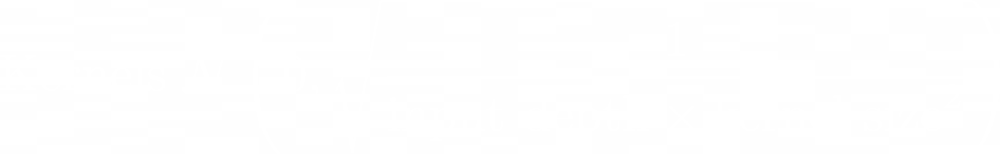</div>
    - <code style="color: SkyBlue;">Random Normal</code>
      <div align="left"> </div>
  - <code style="color: SteelBlue;">Bias initialization:</code>
    - <code style="color: SkyBlue;">Zero</code>
      <div align="left"> </div>
    - <code style="color: SkyBlue;">Random Normal</code>
      <div align="left"> </div>
- <code style="color: teal;">Forward Pass</code> The layer performs convolution operations on the input batch, computing
  feature maps using the specified kernels and biases. It uses multi-threading to parallelize the forward pass for
  improved performance.

1. **Convolution**

   - `Feature Map(f, i, j)` is the result of the convolution for filter `f` at position `(i, j)`.
   - `D` is the input depth (number of input channels).
   - `K` is the kernel size.
   - `Input(d, i * stride + m, j * stride + n)` represents the input patch.
   - `Kernel(f, d, m, n)` is the kernel weight for filter `f`, depth `d`, and position `(m, n)`.
      <div align="left"> 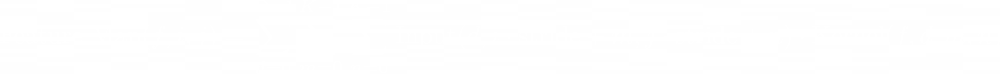</div>

2. **Adding Biases**

   - `Output(f, i, j)` is the final output value after adding bias.
   - `Bias(f)` is the bias term added to the feature map for filter `f`.
      <div align="left"> </div>

- <code style="color: teal;">Backward Pass</code> The backward method calculates gradients with respect to the kernels,
  biases, and input data, which are used for updating the layer's parameters. It supports parallel processing to
  efficiently compute gradients for the entire batch.

1. **Gradient with Respect to Input:**

   - `dInput(d, i, j)` is the gradient of the loss with respect to the input at depth `d`, position `(i, j)`.
   - `F` is the number of filters.
   - `dOutput(f, i - m, j - n)` is the gradient of the loss with respect to the output.
   - `Kernel(f, d, m, n)` is the kernel weight for filter `f`, depth `d`, and position `(m, n)`.
      <div align="left">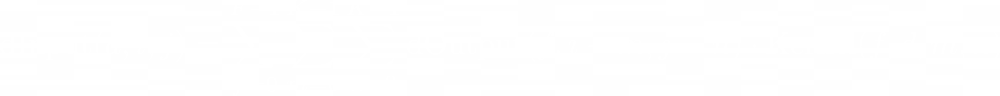</div>

2. **Gradient with Respect to Kernels:**

   - `dKernel(f, d, m, n)` is the gradient of the loss with respect to the kernel at filter `f`, depth `d`, and position
     `(m, n)`.
   - `H` and `W` are the height and width of the output feature map.
   - `dOutput(f, i, j)` is the gradient of the loss with respect to the output.
     <div align="left"> 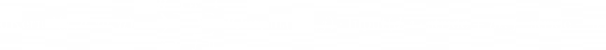</div>

3. **Gradient with Respect to Bias:**

   - `dBias(f)` is the gradient of the loss with respect to the bias for filter `f`.
   - `dOutput(f, i, j)` is the gradient of the loss with respect to the output.
     <div align="left"> 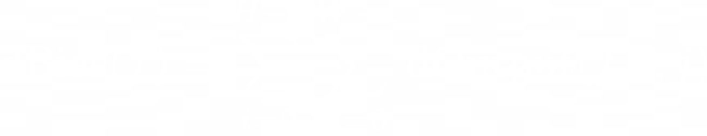</div>

- <code style="color: teal;">Parameter Management</code> The layer provides getters and setters for kernels and biases,
  allowing external manipulation and inspection of these parameters. It ensures that parameter updates are applied using
  an optimizer.

- <code style="color: teal;">Padding and Convolution</code> The layer handles padding of input images, ensuring correct
  spatial dimensions for output feature maps. The convolve method performs the element-wise multiplication of the input
  and kernel tensors over the receptive field, returning the convolution result.

1. **Padding:**

   - `padded_input`: This is the output tensor after padding is applied.
   - `pad`: The amount of padding added to each side of the input tensor.
   - `input`: The original input tensor before padding.
   - `i, j`: Indices of the original input tensor.
     <div align="left"> </div>

2. **Convolve:**

   - `Sum`: This is the result of the convolution operation.
   - `Kernel Height`: The height of the kernel matrix.
   - `Kernel Width`: The width of the kernel matrix.
   - `Input`: The input tensor being convolved.
   - `Kernel`: The kernel or filter applied to the input.
   - `Start Row/Column`: The starting positions in the input tensor from where the kernel is applied.
     <div align="left"> 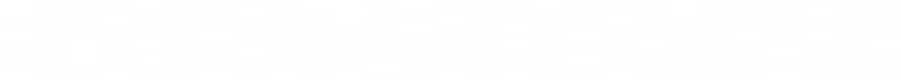</div>

- <code style="color: teal;">Thread Pool</code> It utilizes thread pools for both forward and backward passes,
  distributing computation across available CPU cores (hardware threads) to optimize processing speed.

- <code style="color: teal;">Output Height and Width Calculation</code>:

  <div align="left"> 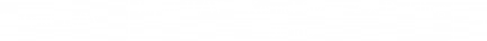</div>

- <code style="color: teal;">Error Handling</code> It provides error detection mechanism:

  - Throws exception if filters, kernel size, stride, or padding are invalid during initialization.
  - Validates output dimensions during the forward pass, ensuring they are positive.
  - Ensures padding values are non-negative and appropriately sized.
  - Logs errors when setting kernels and biases if dimensions mismatch.
  - Checks for dimension mismatches in setKernels and setBiases, throwing exceptions if necessary.

---

### Max Pooling Layer

The MaxPoolingLayer class implements a max pooling layer for neural networks, which reduces the spatial dimensions of
the input while retaining the most important features. This class is crucial for down-sampling input feature maps,
leading to a more efficient and less complex network.

- <code style="color: teal;">Initialization:</code>

  - <code style="color: SteelBlue;">Pool Size</code>
  - <code style="color: SteelBlue;">Stride</code>

- <code style="color: teal;">Forward Pass</code> The forward method applies the max pooling operation on each input
  batch, extracting the maximum value from each pooling window to form the output feature maps. It also stores the
  indices of these maximum values for use during backpropagation.

  - `i,j`: Indices of the output feature map
  - `m,n`: Iterators over the pooling window, each ranging from 0 to Pool Size - 1
  - `Stride`: The stride of the pooling operation
    <div align="left"> 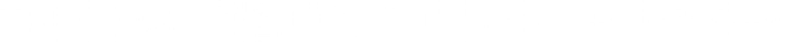</div>

- <code style="color: teal;">Backward Pass</code> During backpropagation, the backward method uses the stored indices to
  propagate gradients back to the input layer. It ensures that only the positions corresponding to the maximum values
  from the forward pass receive non-zero gradients, which helps in updating weights effectively.

  - `dOutput(i,j)`: The gradient of the loss with respect to the output at position (i, j).
  - `Gradients`: Routed only to those indices that correspond to the maximum values used in the forward pass, and all
  other gradients are set to zero.
    <div align="left"> 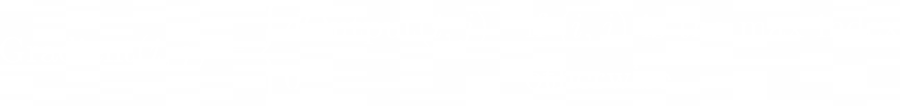</div>

- <code style="color: teal;">Index Management</code> The class maintains indices of maximum values for each pooling
  window in each input image, facilitating accurate gradient propagation during the backward pass.

- <code style="color: teal;">Output Height and Width Calculation</code>

  <div align="left">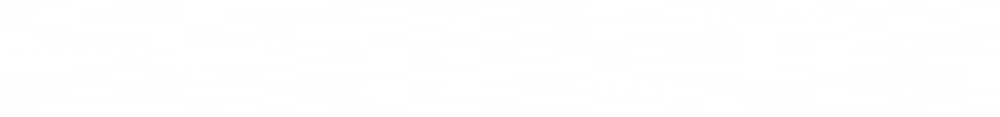</div>

- <code style="color: teal;">Error Handling</code> It checks for invalid pooling configurations by ensuring that the
  calculated output dimensions are positive. If not, it throws an exception indicating potentially incompatible pool
  size or stride settings.

---

### Average Pooling Layer

The AveragePoolingLayer class implements an average pooling layer for neural networks, which reduces the spatial
dimensions of input feature maps by computing the average of elements within a defined pooling window. This process
helps to down-sample the input, reducing the number of parameters and computations in the network, while maintaining
essential spatial information.

- <code style="color: teal;">Initialization:</code>
- <code style="color: SteelBlue;">Pool Size</code>
- <code style="color: SteelBlue;">Stride</code>

- <code style="color: teal;">Forward Pass</code> The forward method applies the average pooling operation to each input
  batch, calculating the average of the values in each pooling window and forming the output feature maps. This method
  is essential for down-sampling and reducing the spatial dimensions of the input data while preserving important
  feature information.

  - `i,j`: Indices of the output feature map
  - `m,n`: Iterators over the pooling window, each ranging from 0 to Pool Size - 1
  - `Stride`: The stride of the pooling operation.
    <div align="left">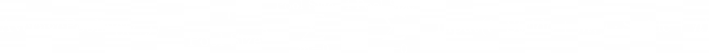</div>

- <code style="color: teal;">Backward Pass</code> During backpropagation, the backward method computes the gradients for
  the input data. The gradient from the output is evenly distributed across the positions within the corresponding
  pooling window, enabling proper weight updates during training.

  - `dOutput(i,j)`: The gradient of the loss with respect to the output at position (i, j).
  - `Pool Size`: Pool Size is the total number of elements in the pooling window
    <div align="left">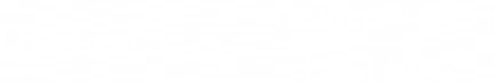</div>

- <code style="color: teal;">Output Height and Width Calculation</code>
  <div align="left"></div>

- <code style="color: teal;">Error Handling</code> The layer checks for valid configurations by ensuring that the
  calculated output dimensions are positive. It will throw an exception if invalid pooling size or stride values result
  in negative output dimensions.

---

### Activation Layer

The ActivationLayer class implements various activation functions used in neural networks to introduce non-linearity
into the model. This class offers flexibility by supporting multiple activation types and their respective derivatives,
which are essential for both the forward and backward passes of the network. The key features of this class are:

- <code style="color: teal;">Supported Activation Types:</code>

  - <code style="color: SteelBlue;">ReLU</code>
    <div align="left"></div>
    <div align="left">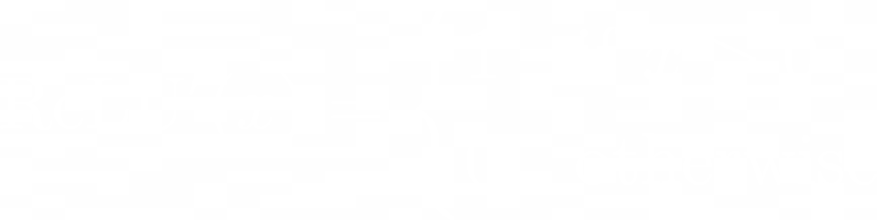</div>

  - <code style="color: SteelBlue;">Leaky ReLU</code>
    <div align="left">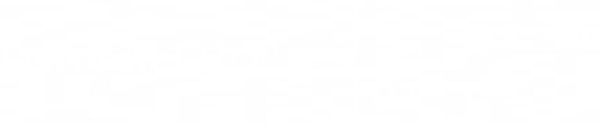</div>
    <div align="left">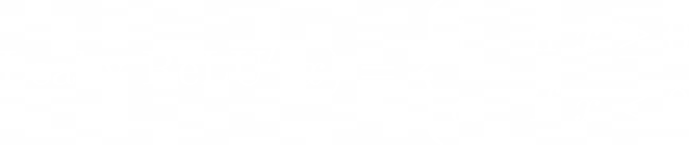</div>

  - <code style="color: SteelBlue;">ELU</code>
    <div align="left">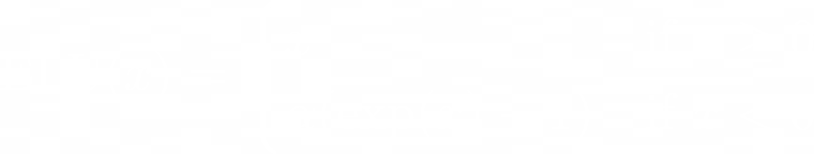</div>
    <div align="left">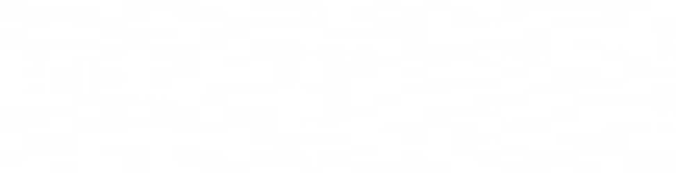</div>

  - <code style="color: SteelBlue;">Sigmoid</code>
    <div align="left">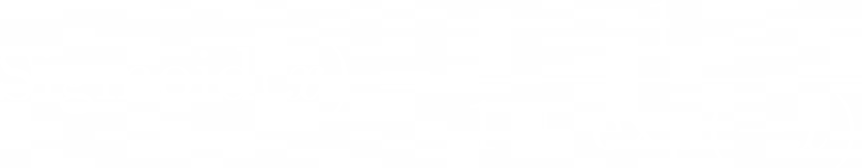</div>
    <div align="left">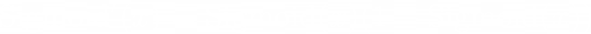</div>

  - <code style="color: SteelBlue;">Softmax</code>
    <div align="left">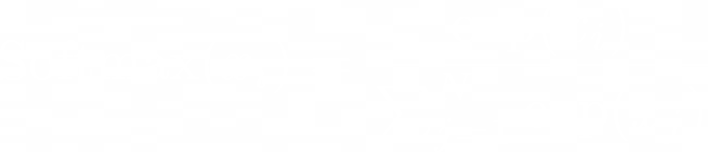</div>
    <div align="left">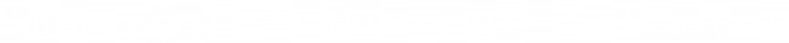</div>

  - <code style="color: SteelBlue;">TanH</code>
    <div align="left">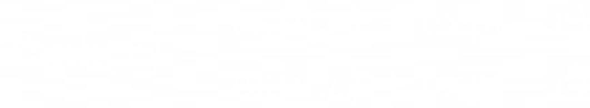</div>
    <div align="left"></div>

- <code style="color: teal;">Forward Pass</code> The forward method applies the chosen activation function to each
  element of the input tensor, allowing for both 2D and 4D input structures by wrapping and unwrapping tensors as
  needed.

- <code style="color: teal;">Backward Pass</code> Computes the derivative of the activation function for the backward
  propagation step, which is crucial for updating network parameters during training.

- <code style="color: teal;">Error Handling</code> The class checks for unsupported activation types and throws
  exceptions if such a type is encountered.

---

### Flatten Layer

The FlattenLayer class is designed to transform multi-dimensional input tensors into flat vectors, making it essential
for connecting convolutional layers to fully connected layers in a neural network. Here are its key functionalities:

- <code style="color: teal;">Forward Pass</code> The FlattenLayer reshapes the input tensor from (batch_size, depth,
  height, width) to a 2D tensor with shape (batch_size, flattened_size), where flattened_size is the product of depth,
  height, and width. The output is returned as a 4D tensor with shape (batch_size, 1, 1, flattened_size).
  <div align="left"></div>

- <code style="color: teal;">Backward Pass</code> It reshapes the gradient from the output tensor back to the original
  shape of the input tensor, allowing gradients to propagate correctly through the network.
  <div align="left"></div>

- <code style="color: teal;">Shape Management</code> The layer tracks the original dimensions of the input tensor to
  ensure accurate reshaping during both the forward and backward passes.

- <code style="color: teal;">Error Handling</code> The layer checks for consistency in reshaping operations and will
  throw an exception if there is a mismatch in dimensions during the backward pass.

---

### Fully Connected Layer

The FullyConnectedLayer class represents a dense layer in a neural network, where each neuron is connected to every
neuron in the previous layer. It is responsible for learning linear combinations of the input features, which are then
used for predictions or further transformations.

- <code style="color: teal;">Initialization:</code>

  - <code style="color: SteelBlue;">Weights:</code>

    - <code style="color: SkyBlue;">He</code>
      <div align="left">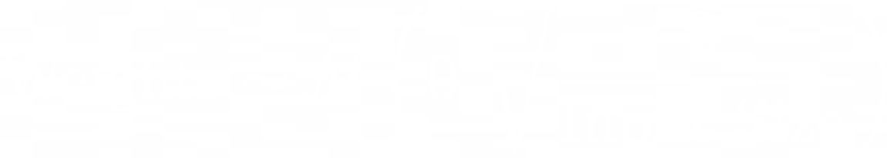</div>

    - <code style="color: SkyBlue;">Xavier</code>
      <div align="left">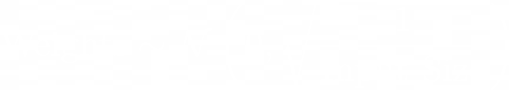</div>

    - <code style="color: SkyBlue;">Random Normal</code>
      <div align="left"></div>

  - <code style="color: SteelBlue;">Biases:</code>

    - <code style="color: SkyBlue;">Zero</code>
      <div align="left"></div>

    - <code style="color: SkyBlue;">Random Normal</code>
      <div align="left"></div>

- <code style="color: teal;">Optimizer Requirement</code> This layer requires an optimizer to update weights and biases
  during training, as it contains trainable parameters.

- <code style="color: teal;">Forward Pass</code> The forward method takes an input batch of 4D tensors, flattens it to a
  2D tensor, and performs matrix multiplication with the weights, followed by the addition of biases. The result is
  reshaped back into a 4D tensor with the shape (batch_size, 1, 1, output_size).

1. **Matrix Multiplication:**

   - `b`: is the batch index.
   - `o`: is the output neuron index.
   - `i`: is the input feature index.
   - `input_2d(b, i)`: the value of the input feature `i` for the batch `b`.
   - `weights(o, i)`: the weight associated with the connection between input feature `i` and output neuron `o`.
   - `output_2d(b, o)`: the resulting output for neuron `o` in batch `b`.
     <div align="left">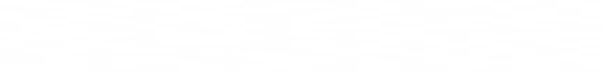</div>

1. **Adding Bias:**

   - `b`: is the batch index.
   - `o`: is the output neuron index.
   - `output_2d(b, o)`: the computed output before adding the bias.
   - `biases(o)`: the bias for the output neuron `o`.
     <div align="left"></div>

- <code style="color: teal;">Backward Pass</code> During the backward pass, the layer calculates the gradients of the
  loss with respect to its weights, biases, and inputs. These gradients are used to update the parameters using the
  optimizer.

1. **Gradient with respect to weights:**

   - `b`: is the batch index.
   - `o`: is the output neuron index.
   - `i`: is the input feature index.
   - `d_weights(o,i)`: is the gradient of the weight connecting input feature `i` to output neuron `o`.
   - `input_2d(b, i)`: the value of the input feature `i` for the batch `b`.
   - `d_output_2d(b,o)`: The partial derivative of the loss function with respect to the output of the neuron at index
     `o` for the `b`-th example in the batch.
     <div align="left">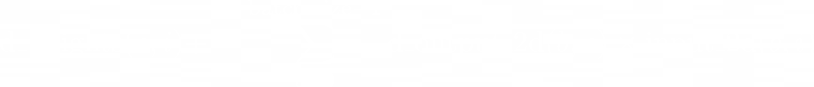</div>

2. **Gradient with respect to biases:**

   - `b`: is the batch index.
   - `o`: is the output neuron index.
   - `input_2d(b, i)`: the value of the input feature `i` for the batch `b`.
   - `d_output_2d(b,o)`: The partial derivative of the loss function with respect to the output of the neuron at index
     `o` for the `b`-th example in the batch.
   - `d_biases(o)`: is the gradient of the bias for output neuron `o`.
      <div align="left">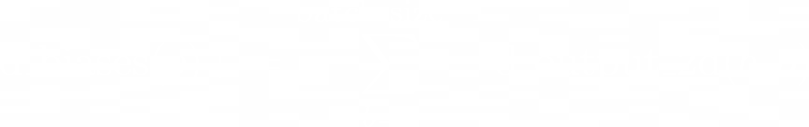</div>

3. **Gradient with respect to inputs:**

   - `b`: is the batch index.
   - `o`: is the output neuron index.
   - `i`: is the input feature index.
   - `d_input_2d(b,i)`: partial derivative of the loss function with respect to the input value at index `i` for the
     `b`-th example in the batch. This gradient is propagated to the previous layer.
   - `d_output_2d(b,o)`: The partial derivative of the loss function with respect to the output of the neuron at index
     `o` for the `b`-th example in the batch.
   - `weights(o,i)`: weight connecting input feature `i` to output neuron `o`.
      <div align="left">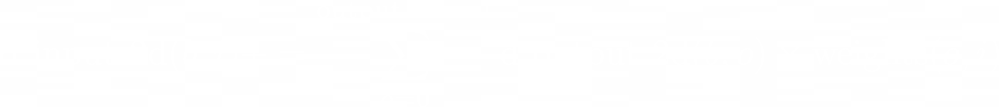</div>

- <code style="color: teal;">Parameter Management</code> The class provides methods for setting and retrieving weights
  and biases, ensuring that they conform to the specified dimensions. It also includes error handling to check for
  mismatched dimensions when setting new weights or biases.

- <code style="color: teal;">Error Handling</code> The layer validates input and output dimensions during both forward
  and backward passes, throwing exceptions for any inconsistencies in the expected and actual dimensions. It ensures
  that both input and output sizes are positive integers, maintaining the integrity of the network configuration.

---

### Batch Normalization Layer

The BatchNormalizationLayer class implements batch normalization for neural networks, a technique used to stabilize and
accelerate training by normalizing the input of each layer. This layer helps improve the convergence rate and overall
performance of the network by maintaining mean and variance at stable levels. It sets up internal tensors for scaling
(gamma) and shifting (beta), as well as moving averages of mean and variance.

- <code style="color: teal;">Initialization:</code>

  - <code style="color: SkyBlue;">Epsilon</code>
  - <code style="color: SkyBlue;">Momentum</code>

- <code style="color: teal;">Forward Pass</code> The forward method computes the mean and variance for the current
  batch, normalizes the input data, and scales and shifts it using gamma and beta. It also updates the moving averages
  of mean and variance using the specified momentum.

  <div align="left">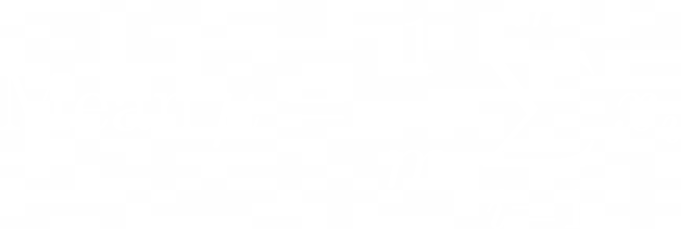</div>

  <div align="left">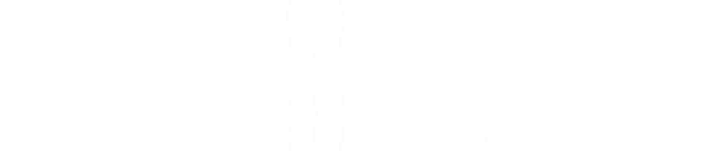</div>

  <div align="left">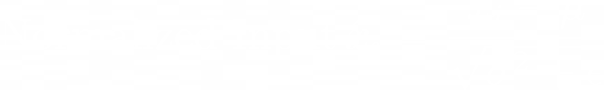</div>

  <div align="left">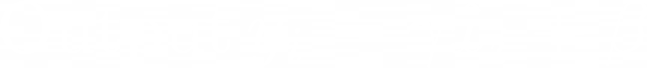</div>

- <code style="color: teal;">Backward Pass</code> During backpropagation, the backward method computes gradients with
  respect to the input data, as well as the gamma and beta parameters. These gradients are used to update the parameters
  directly.

  <div align="left">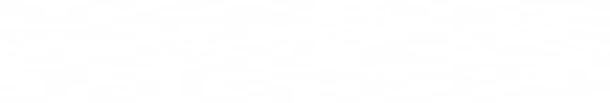</div>

  <div align="left">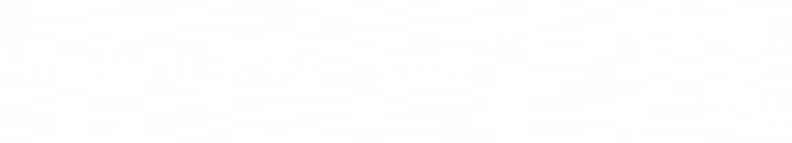</div>

- <code style="color: teal;">Parameter Management</code> The class provides methods for setting and retrieving gamma and
  beta, allowing external manipulation and inspection. It ensures that updates to these parameters are applied correctly
  during training.

- <code style="color: teal;">Error Handling</code> The layer includes checks to ensure that the initialization state is
  set correctly before performing forward or backward passes, preventing errors due to uninitialized parameters.

---

### Loss Function

The LossFunction class and its derived classes implement various loss functions used in neural networks to measure the
difference between predicted outputs and true targets. The key functionalities of each class are as follows:

- <code style="color: teal;">Binary Cross Entropy Loss</code> This loss function is used for binary classification
  tasks. It computes the loss using the binary cross-entropy formula and applies clipping to the predictions for
  numerical stability. The derivative method calculates the gradient of the loss with respect to the predictions.

  <div align="left">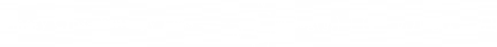</div>

  <div align="left">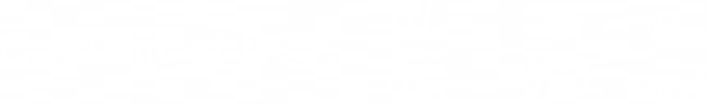</div>

- <code style="color: teal;">Mean Squared Error Loss</code> Used for regression tasks, this loss function computes the
  average squared difference between predictions and targets. The derivative method calculates the gradient of the loss
  with respect to the predictions.

  <div align="left">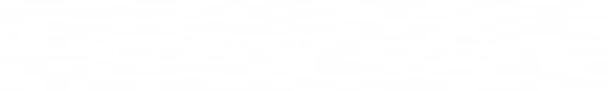</div>

  <div align="left">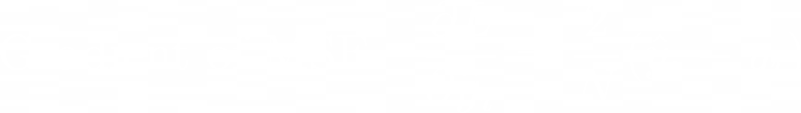</div>

- <code style="color: teal;">Categorical Cross Entropy Loss</code> This loss function is used for multi-class
  classification tasks with one-hot encoded targets. It calculates the loss using the categorical cross-entropy formula,
  summing the loss for each class where the target is 1. The derivative method calculates the gradient with respect to
  the predictions, assuming one-hot encoded targets.

  <div align="left">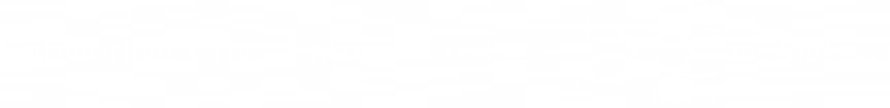</div>

  <div align="left">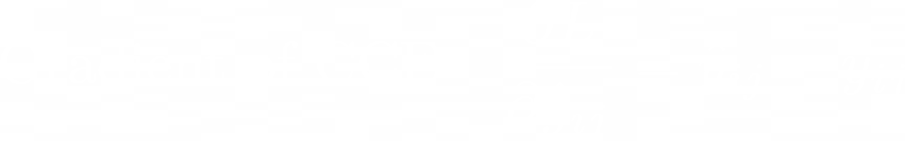</div>

- <code style="color: teal;">Factory Method</code> The LossFunction class includes a factory method, create, which
  instantiates a specific loss function object based on the provided LossType. This allows for flexibility in choosing
  the appropriate loss function during model creation.

---

### Optimizer

The Optimizer class and its derived classes implement various optimization algorithms used in training neural networks
to minimize the loss function and update the model parameters efficiently. The key functionalities of each class are as
follows:

- <code style="color: teal;">SGD</code> (Stochastic Gradient Descent) This optimizer updates weights and biases by
  applying a simple learning rate-scaled gradient descent step. It uses the applyUpdates method from the
  TensorOperations class to adjust the parameters directly with gradients.

  <div align="left"></div>

  <div align="left">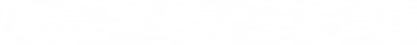</div>

- <code style="color: teal;">SGD with Momentum</code> This optimizer extends SGD by adding a momentum term that helps to
  accelerate the optimization process in the relevant direction and dampen oscillations. It maintains velocity terms
  (v_weights and v_biases) for weights and biases, which are updated iteratively and used to adjust the model
  parameters.

  <div align="left">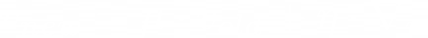</div>

  <div align="left"></div>

  <div align="left">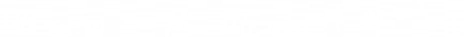</div>

  <div align="left"></div>

- <code style="color: teal;">Adam</code> This optimizer combines the advantages of both the AdaGrad and RMSProp
  algorithms, maintaining adaptive learning rates for each parameter by computing first (mean) and second (variance)
  moments of the gradients. It employs bias-correction terms to ensure unbiased estimates of these moments. Adam
  maintains separate moving averages of gradients (m_weights, m_biases) and squared gradients (v_weights, v_biases) for
  both weights and biases.

  <div align="left">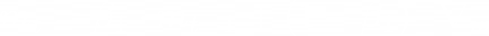</div>

  <div align="left">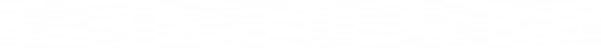</div>

  <div align="left"></div>

  <div align="left">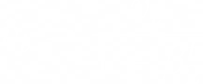</div>

  <div align="left">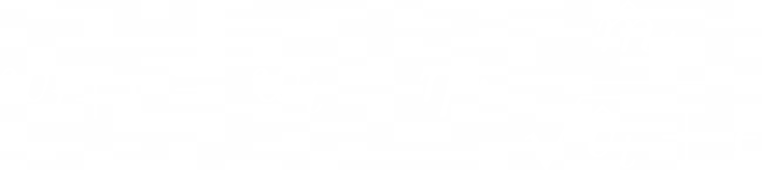</div>

  <div align="left">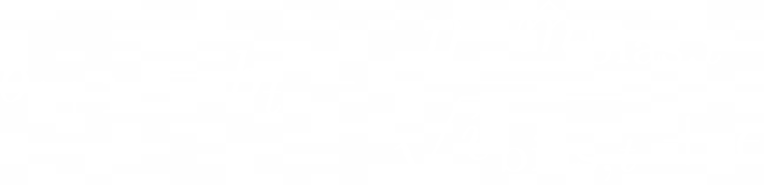</div>

- <code style="color: teal;">RMSprop</code> This optimizer maintains an exponentially decaying average of past squared
  gradients to divide the gradient element-wise, which helps in dealing with the vanishing learning rate problem. It
  updates the weights and biases based on the root mean square of gradients.

  <div align="left">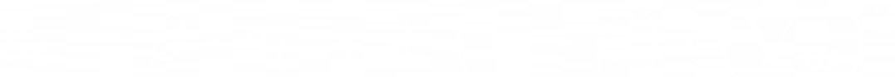</div>

  <div align="left">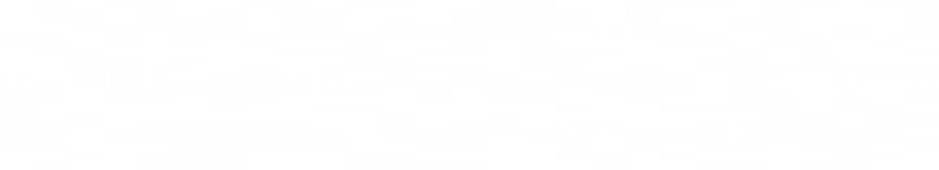</div>

  <div align="left"></div>

  <div align="left"></div>

- <code style="color: teal;">Factory Method</code> The Optimizer class includes a factory method, create, which
  instantiates a specific optimizer object based on the provided OptimizerType and parameters. This allows for
  flexibility in choosing the appropriate optimizer during model training.

---

### Learning Decay

The `LearningDecay` class implements various learning rate decay strategies used to adjust the learning rate during
training, improving convergence for neural network models. The class allows different decay methods to be applied based
on the specified `LearningDecayType` and associated parameters:

- <code style="color: teal;">Decay Type Initialization</code> The constructor accepts a `LearningDecayType` and a map of
  parameters, setting default values if specific parameters are not provided. This ensures the decay method can operate
  with sensible defaults.

- <code style="color: teal;">Exponential Decay</code> Reduces the learning rate exponentially based on a specified decay
  rate. The learning rate decreases continuously over epochs, following the formula:
  <div align="left"></div>

- <code style="color: teal;">Step Decay</code> Reduces the learning rate at fixed intervals or "steps" by a decay
  factor. The learning rate is adjusted using the formula:
  <div align="left"></div>

- <code style="color: teal;">Polynomial Decay</code> Reduces the learning rate following a polynomial function of the
  epoch, reaching a specified `end_learning_rate` after a certain number of `decay_steps`. The formula used is:
  <div align="left"></div>

- <code style="color: teal;">Inverse Time Decay</code> Applies decay so that the learning rate decreases proportionally
  to the inverse of time, using the formula:
  <div align="left"></div>

- <code style="color: teal;">Cosine Decay</code> Applies a cosine decay function to reduce the learning rate, smoothly
  decreasing the learning rate and then increasing it slightly at the end. The formula used is:
  <div align="left"></div>

- <code style="color: teal;">None</code> If no decay is specified, the learning rate remains constant throughout the
  training process.

## Getting Started

### Step 1: Clone the Repository

Begin by cloning the CNN-CPP project repository to your local machine. Use the following command in your terminal:

```bash
git clone https://github.com/kolemare/CNN-CPP.git
```

---

### Step 2: Initialize Submodules

After cloning the main repository, navigate into the CNN-CPP directory to initialize and update the submodules. Execute
the following commands:

```bash
cd CNN-CPP
```

```bash
git submodule update --init --recursive
```

This command ensures that all nested submodules are properly initialized and updated.

---

### Step 3: Installing Dependencies

### Linux

#### Option 1: Native Installation

For Linux users preferring a native setup without Docker, install the necessary dependencies with provided
**install.sh** script.

```bash
sudo ./install.sh
```

This script will install all required software on your Linux machine. This ensures that all necessary components are
properly set up for your development environment.

#### Option 2: Docker Installation

Linux docker setup: [Docker Desktop for Linux installation guide](https://docs.docker.com/engine/install/ubuntu/).

### Windows & Mac OS

Windows docker setup:
[Docker Desktop for Windows installation guide](https://docs.docker.com/desktop/install/windows-install/).  
Mac OS docker setup: [Docker Desktop for Mac installation guide](https://docs.docker.com/desktop/install/mac-install/).

---

### Step 4: Only For Docker

**Linux:**  
Before running Docker commands, make sure that your user belongs to the docker group to avoid using sudo with every
Docker command. If not already configured, you can add your user to the docker group with:

```bash
sudo usermod -aG docker $USER
```

**Windows:**  
Ensure that the Docker Desktop application is running before executing any Docker commands. This application manages
Docker engine and allows container management on Windows.

**Mac OS:**  
Docker on Mac behaves similarly to Linux. Ensure Docker Desktop is running as it provides the necessary Docker engine to
manage containers. You do not need to start a separate Docker service as with Windows.

First, ensure you are positioned at the root of the repository. The Docker image needs to be built only once. To build
the Docker image, use the following command:

```bash
docker build -t cnn-cpp-image .
```

To start the Docker container in interactive mode while mounting the repository directory, use:

```bash
docker run -it -v $(pwd):/CNN_CPP cnn-cpp-image
```

This command starts the Docker container in interactive mode and mounts the entire repository. This setup ensures that
any changes made within the Docker container are immediately visible on the host operating system, and vice versa. To
stop the running Docker container, you can use CTRL+C. Note that if the container is stopped, you will need to rerun the
command to start it again.

After you are done working, you can remove the Docker container to free up resources. Use the following commands to find
the container ID and remove it:

```bash
docker images  # Lists all containers, find the one you want to remove
```

```bash
docker rm [container_id]  # Replace [container_id] with your actual container ID
```

Once the Docker image is removed, you will need to rebuild it if you wish to use Docker again for the CNN-CPP Framework.
Building the Docker image is a one-time requirement unless it is deleted.  
This ensures that all necessary components are properly set up for your development environment.  
Size of Docker image for CNN-CPP is approximately: **1.85GB**

### Dataset Structure

### Graphs

### Image

- Loading
- Augmenting
- Resizing

## Model Example

## Results
